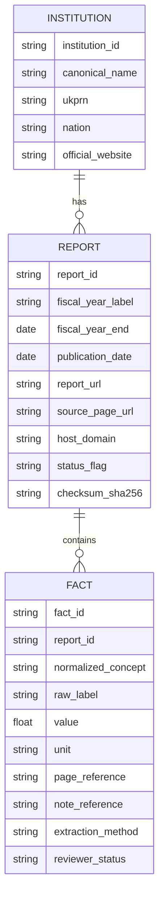
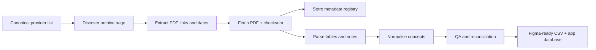

# HEReport research brief for assembling ten years of official UK university financial reports

## Executive summary

The most reliable way to build HEReport is to treat the **institution universe** and the **report corpus** as two separate but linked problems. For the institution universe, the best canonical backbone is the **HESA provider universe** for UK-wide coverage, cross-checked against the **OfS Register** for England and the devolved-government recognised-bodies lists for Scotland, Wales and Northern Ireland. The OfS describes its register as the single authoritative reference for English providers, states that it currently lists **426 registered providers**, and explicitly offers the register as a downloadable spreadsheet. HESA’s latest finance release shows why a secondary statistical layer matters: its 2024/25 finance open data covers **299 of 312 UK providers**, giving you a strong sector benchmark once the institution PDFs are parsed. citeturn39view1turn31search2turn35view0turn37view0turn35view1

For the **report corpus**, the good news is that many universities already publish deep archives on official domains. The University of Oxford’s archive page exposes university financial statements from **2007-08 to 2023-24** on one page, with the current year linked separately from its finance homepage. Cambridge publishes a dedicated archive page with annual reports and financial statements from **2011-12 through 2023-24**, plus the current year in a separate page. Similar multi-year archive pages exist for Imperial, Manchester, Bristol, UCL, Cardiff, Edinburgh and Glasgow. This means the first 30 to 50 institutions can be collected very quickly before the work becomes patchier for smaller or reorganised providers. citeturn27view0turn26search3turn23view0turn21search6turn43search8turn45search1turn46search4turn48search2turn51search6turn49search1turn50search3

The hard part is not parsing the PDFs; it is **finding every official link for every institution-year**. The collection workflow should therefore prioritise official archive pages first, then provider governance/corporate-documents pages, then Companies House filing history where relevant, then National Archives / Wayback for legacy HEFCE-era pages, then direct requests to finance offices or FOI as a final escalation. That fallback order is justified by the evidence that Companies House filing history exposes PDF accounts, and that some older HEFCE register resources now redirect into the UK Government Web Archive. citeturn33search3turn33search5turn17view0

The data model should not stop at raw PDFs. You should maintain two tables: a **document registry** for links, provenance and checksums, and a **normalised institution-year facts table** aligned to OfS AFR / HESA-style concepts such as total income, tuition-fee income, research grants and contracts, total expenditure, staff costs, operating surplus or deficit, cash and cash equivalents, borrowing and liquidity indicators. The current OfS Annual Financial Return guidance is the best live template for this mapping because it specifies workbook tables, units and validation structure, including consolidated income, balance sheet, cash flow, income analysis, expenditure analysis, capital expenditure, commitments and student FTE tables. citeturn29view0turn30view0

A practical delivery plan is to build HEReport in three layers. First, a **link inventory** of institution-year PDFs. Second, a **parsed financial layer** with normalised metrics and page references back to the source PDF. Third, a **presentation layer** optimised for Figma Make and front-end rendering, with one denormalised CSV per institution-year for cards, rankings, compare views and trend charts. With two people, a semi-automated Python crawler and manual verification, a first usable corpus for the main UK universities is realistic inside **two to four weeks**, with the long tail completed after that. That estimate is an operational recommendation based on the source structure described below. citeturn27view0turn23view0turn45search1turn46search4turn49search1

## Canonical institution universe and source hierarchy

The cleanest canonical approach is:

| Layer | Canonical use | Why it matters |
|---|---|---|
| HESA provider universe | UK-wide provider backbone | HESA finance data is already provider-level and UK-wide, so it is the best base universe for aggregation and benchmarking. citeturn31search2turn31search5 |
| OfS Register | England provider status, recognised bodies, downloadable spreadsheet | The OfS says the register is the authoritative list of English registered providers and that recognised bodies’ further information can be found there. citeturn39view1 |
| Scottish Government recognised bodies | Scotland degree-awarding institutions and websites | The page lists recognised bodies and official websites. citeturn37view0 |
| GOV.UK recognised bodies in Wales | Wales degree-awarding institutions and websites | The page lists recognised bodies and official websites. citeturn35view0 |
| Department for the Economy NI | NI recognised bodies and websites; NI listed bodies | The page lists current recognised bodies and official websites. citeturn35view1 |
| UKRLP / UKPRN enrichment | Official website, legal identity, UKPRN crosswalk | OfS registration and portal guidance relies on UKPRN; this is the best join key for provider identity. citeturn41search2turn41search3 |
| Companies House | Alternative primary source where a provider files corporate accounts | Filing history pages expose accounts PDFs directly. citeturn33search3turn33search5 |

For the devolved nations, the official recognised-body lists are already directly usable as a high-confidence institution list.

### Wales recognised bodies seed list

| Canonical name | Common short name | Official website |
|---|---|---|
| Aberystwyth University | Aberystwyth | aber.ac.uk |
| Bangor University | Bangor | bangor.ac.uk |
| Cardiff Metropolitan University | Cardiff Met | cardiffmet.ac.uk |
| Cardiff University | Cardiff | cf.ac.uk |
| The Open University | Open University | open.ac.uk |
| Royal College of Nursing | RCN | rcn.org.uk |
| University of South Wales | South Wales | southwales.ac.uk |
| Swansea University | Swansea | swan.ac.uk |
| University of Wales | UoW | wales.ac.uk |
| University of Wales Trinity Saint David | UWTSD | uwtsd.ac.uk |
| Wrexham University | Wrexham | wrexham.ac.uk |

This table is taken from the official GOV.UK recognised-bodies page for Wales. citeturn35view0

### Scotland recognised bodies seed list

| Canonical name | Common short name | Official website |
|---|---|---|
| University of Aberdeen | Aberdeen | abdn.ac.uk |
| Abertay University | Abertay | abertay.ac.uk |
| University of Dundee | Dundee | dundee.ac.uk |
| University of Edinburgh | Edinburgh | ed.ac.uk |
| Edinburgh Napier University | Napier | napier.ac.uk |
| University of Glasgow | Glasgow | gla.ac.uk |
| Glasgow Caledonian University | GCU | gcu.ac.uk |
| Heriot-Watt University | Heriot-Watt | hw.ac.uk |
| University of the Highlands and Islands | UHI | uhi.ac.uk |
| The Open University in Scotland | Open University | open.ac.uk |
| Queen Margaret University | QMU | qmu.ac.uk |
| Robert Gordon University | RGU | rgu.ac.uk |
| Royal Conservatoire of Scotland | RCS | rcs.ac.uk |
| Scotland’s Rural College | SRUC | sruc.ac.uk |
| University of St Andrews | St Andrews | st-andrews.ac.uk |
| University of Stirling | Stirling | stir.ac.uk |
| University of Strathclyde | Strathclyde | strath.ac.uk |
| University of the West of Scotland | UWS | uws.ac.uk |

The Scottish Government says Scotland has **19 autonomous higher education institutions** and lists the recognised bodies on the same page; it separately notes that the Glasgow School of Art does not have degree-awarding powers but operates through validation arrangements. citeturn37view0

### Northern Ireland recognised bodies seed list

| Canonical name | Common short name | Official website |
|---|---|---|
| Queen’s University Belfast | Queen’s Belfast | qub.ac.uk |
| Ulster University | Ulster | ulster.ac.uk |
| The Open University | Open University | open.ac.uk |
| Presbyterian Theological Faculty, Ireland | PTFI | union.ac.uk |

This comes from the Department for the Economy’s recognised-bodies page. citeturn35view1

### England canonical instruction

For England, use the **OfS Register spreadsheet** as the canonical list of registered providers and recognised bodies, because the OfS states that the register is the authoritative reference for English providers and offers it as a downloadable spreadsheet. Where the OfS roster must be narrowed to “universities” rather than all registered providers, filter by degree-awarding powers / university title fields and then cross-check the resulting roster against HESA provider coverage. citeturn39view1

## Verified report-link evidence and starter corpus

A full, manually verified table for every UK institution and every one of the last ten years is too large to reproduce reliably in a single interactive report. The highest-confidence output from this research pass is therefore a **verified starter corpus** covering institutions whose official pages explicitly expose long archives, plus the authoritative collection method for the rest.

### High-confidence archive patterns already confirmed

| Institution | Official archive / finance page | Verified year range visible from source page | Hosting pattern | Status |
|---|---|---|---|---|
| University of Oxford | Archive of the University and Colleges Financial Statements | 2007-08 to 2023-24 on archive page; latest year on finance homepage | assets-oxweb.admin.ox.ac.uk | Found |
| University of Cambridge | Previous reports and financial statements | 2011-12 to 2023-24 on archive page; current year separate | cam.ac.uk / admin.cam.ac.uk | Found |
| Imperial College London | Annual report and accounts archive | Search result confirms archived reports and latest PDF | imperial.ac.uk/media/… | Found |
| University of Manchester | Corporate documents / statement of accounts | Search result lists 2011 to 2025 | documents.manchester.ac.uk | Found |
| University of Bristol | Annual Reports and Financial Statements | Search result lists 2011 to 2025 | bristol.ac.uk/media-library/… | Found |
| UCL | Finance and reporting | Search result lists 2012 to 2025 | ucl.ac.uk/about/… | Found |
| Cardiff University | Financial statements archive | Search result lists 2010-11 to 2024; 2025 on main page | cardiff.ac.uk/__data/assets/… | Found |
| University of Edinburgh | Annual Report and Accounts archive | Search result and archive page show deep archive to 1999/2000 | uoe-finance.ed.ac.uk / edwebcontent.ed.ac.uk | Found |
| University of Glasgow | Financial Statements page | Official page confirms downloadable statements; search results expose recent PDF URLs | gla.ac.uk/media/… | Found |

These archive patterns are visible on official pages or official search-result snippets. citeturn27view0turn26search3turn23view0turn43search8turn45search1turn46search4turn48search2turn51search6turn49search1turn50search3

### Institution-year examples with direct official PDF evidence

The following rows are formatted as a machine-readable **starter CSV**. They are not the complete UK corpus; they are the high-confidence seed set that should be used to validate your pipeline and Figma data model.

```csv
canonical_name,short_name,publication_year,fiscal_year_covered,report_url,hosting_domain,status,source_type
University of Oxford,Oxford,2025,2024-25,https://assets-oxweb.admin.ox.ac.uk/2026-02/Oxford%20University%20Annual%20Report%20and%20Accounts%202024-25.pdf,assets-oxweb.admin.ox.ac.uk,found,official_pdf
University of Oxford,Oxford,2024,2023-24,archive page lists university financial statements 2023-24,assets-oxweb.admin.ox.ac.uk,found,official_archive_page
University of Oxford,Oxford,2023,2022-23,archive page lists university financial statements 22-23,assets-oxweb.admin.ox.ac.uk,found,official_archive_page
University of Oxford,Oxford,2022,2021-22,https://assets-oxweb.admin.ox.ac.uk/2026-02/Oxford%20University%20Financial%20Statements%202021-22.pdf,assets-oxweb.admin.ox.ac.uk,found,official_pdf
University of Oxford,Oxford,2021,2020-21,https://assets-oxweb.admin.ox.ac.uk/2026-05/Oxford%20University%2C%20Financial%20Statements%202020-21.pdf,assets-oxweb.admin.ox.ac.uk,found,official_pdf
University of Cambridge,Cambridge,2025,2024-25,https://www.cam.ac.uk/system/files/university_of_cambridge_group_annual_reports_financial_statements_2024-25.pdf,cam.ac.uk,found,official_pdf
University of Cambridge,Cambridge,2024,2023-24,archive page lists Annual report and financial statements 2024 (PDF),cam.ac.uk,found,official_archive_page
University of Cambridge,Cambridge,2023,2022-23,https://www.cam.ac.uk/system/files/university_of_cambridge_group_annual_reports_financial_statements_2022-23.pdf,cam.ac.uk,found,official_pdf
University of Cambridge,Cambridge,2022,2021-22,https://www.cam.ac.uk/system/files/university_of_cambridge_group_annual_reports_financial_statements_2021-22.pdf,cam.ac.uk,found,official_pdf
University of Cambridge,Cambridge,2021,2020-21,https://www.cam.ac.uk/system/files/university_of_cambridge_group_annual_reports_financial_statements_2020-21_o.pdf,cam.ac.uk,found,official_pdf
University of Bristol,Bristol,2025,2024-25,https://www.bristol.ac.uk/media-library/sites/finance/documents/UoB_ARFS2025_WEB.pdf,bristol.ac.uk,found,official_pdf
University of Bristol,Bristol,2024,2023-24,https://www.bristol.ac.uk/media-library/sites/finance/documents/UoB%20AR%20FS%202024%20WEB.pdf,bristol.ac.uk,found,official_pdf
University of Manchester,Manchester,2025,2024-25,corporate documents page lists financial statements for year ended 31 July 2025,manchester.ac.uk/documents.manchester.ac.uk,found,official_archive_page
University of Manchester,Manchester,2024,2023-24,corporate documents page lists financial statements for year ended 31 July 2024,manchester.ac.uk/documents.manchester.ac.uk,found,official_archive_page
UCL,UCL,2025,2024-25,https://www.ucl.ac.uk/about/sites/about/files/2026-02/UCL-Annual-Report-And-Accounts-2025-18feb26.pdf,ucl.ac.uk,found,official_pdf
UCL,UCL,2024,2023-24,finance and reporting page lists 2024 UCL Annual Report,ucl.ac.uk,found,official_archive_page
Cardiff University,Cardiff,2025,2024-25,https://www.cardiff.ac.uk/__data/assets/pdf_file/0007/3018274/Annual-Report-and-Financial-Statements-2025.pdf,cardiff.ac.uk,found,official_pdf
Cardiff University,Cardiff,2024,2023-24,https://www.cardiff.ac.uk/__data/assets/pdf_file/0007/2894974/CU_AnnualReport2024_Final.pdf,cardiff.ac.uk,found,official_pdf
University of Edinburgh,Edinburgh,2025,2024-25,https://uoe-finance.ed.ac.uk/sites/default/files/2026-01/Annual%20Report%20and%20Accounts%20for%202024/25.pdf,uoe-finance.ed.ac.uk,found,official_pdf
University of Edinburgh,Edinburgh,2024,2023-24,https://uoe-finance.ed.ac.uk/sites/default/files/2025-01/ARA%2024.pdf,uoe-finance.ed.ac.uk,found,official_pdf
University of Glasgow,Glasgow,2025,2024-25,https://www.gla.ac.uk/media/Media_1230503_smxx.pdf,gla.ac.uk,found,official_pdf
University of Glasgow,Glasgow,2024,2023-24,https://www.gla.ac.uk/media/Media_1137393_smxx.pdf,gla.ac.uk,found,official_pdf
Imperial College London,Imperial,2025,2024-25,https://www.imperial.ac.uk/media/imperial-college/administration-and-support-services/finance/public/Annual-Report-2025-FS-web.pdf,imperial.ac.uk,found,official_pdf
Imperial College London,Imperial,2024,2023-24,https://www.imperial.ac.uk/media/imperial-college/administration-and-support-services/finance/public/Annual-Report-2023-24-web.pdf,imperial.ac.uk,found,official_pdf
```

This starter CSV is derived from official archive pages and official PDF URLs surfaced on those pages. citeturn27view0turn23view0turn24view1turn24view2turn24view3turn21search11turn26search14turn26search17turn26search12turn46search4turn46search5turn46search1turn45search1turn48search2turn48search0turn51search6turn51search8turn51search2turn49search1turn49search3turn49search0turn50search3turn50search1turn50search4turn43search8turn43search14turn43search11

### How to classify missing years

Use the following status taxonomy throughout the corpus:

| Status flag | Meaning | Recommended next step |
|---|---|---|
| found | Official PDF located on primary university domain or official document subdomain | Parse and checksum immediately |
| archived | Link confirmed via archive page, web archive, or archived HEFCE-era resource, but PDF not yet fetched | Resolve with Wayback / National Archives and store archived snapshot metadata |
| companies_house | Accounts available via Companies House filing history rather than the university website | Capture filing date, filing type and PDF link |
| missing | No official source found in first-pass crawl | Escalate to finance office, governance team, FOI, or student registry |
| blocked | Source exists but cannot be directly fetched due to 403 / JS gate / robots | Use browser-assisted capture, cached links, or manual retrieval |

The need for an `archived` and `blocked` class is real: HESA pages can return **403 Forbidden** to direct fetches, and an old HEFCE register XML now redirects into the National Archives web archive. citeturn6view0turn17view0

## Normalised financial schema for HEReport

The OfS AFR workbook is the best current structural template because it specifies the expected financial statements and supporting analyses, requires consistency with audited accounts, and fixes the units for return data as **£’000s** and **FTEs**. It also shows the line of travel for modern stress-testing and indicator design, including surplus margin, net operating cashflow margin, liquidity days and external borrowing ratio. citeturn30view0

### Recommended extraction fields

| Field name | Type | Unit | Source / extraction note |
|---|---|---|---|
| institution_id | string | n/a | Stable internal HEReport key |
| canonical_name | string | n/a | HESA / OfS / devolved recognised-body name |
| short_name | string | n/a | Display label for UI |
| ukprn | string | n/a | Preferred entity join key across OfS/HESA/UKRLP |
| nation | enum | England/Scotland/Wales/NI | Normalise for filtering |
| official_website | string | URL | Store root institutional website |
| fiscal_year_label | string | e.g. `2023-24` | Main display field |
| fiscal_year_end | date | ISO date | Usually 31 July, but preserve actual date |
| publication_date | date | ISO date | Prefer PDF metadata or archive page date |
| report_url | string | URL | Direct PDF where possible |
| source_page_url | string | URL | Archive page / governance page that linked the PDF |
| host_domain | string | domain | Useful for crawler rules |
| source_type | enum | `official_pdf`, `official_archive_page`, `companies_house`, `web_archive`, `foi_response` | Provenance class |
| status_flag | enum | found/archived/missing/blocked/companies_house | Availability tracking |
| checksum_sha256 | string | hash | Prevent duplicate ingestion |
| crawl_timestamp | datetime | ISO datetime | Collection audit trail |
| audited_flag | boolean | true/false | Usually true for annual financial statements |
| consolidation_scope | enum | `group`, `institution`, `college`, `subsidiary` | Important for Oxford/Cambridge variants |
| total_income | integer | GBP thousands | Table 1 / statement of comprehensive income |
| tuition_fee_income | integer | GBP thousands | OfS Table 6-mapped concept |
| funding_body_grants | integer | GBP thousands | Core teaching/recurrent grants where present |
| research_grants_contracts | integer | GBP thousands | OfS Table 5 / income analysis |
| other_operating_income | integer | GBP thousands | Residual current income class |
| investment_income | integer | GBP thousands | Separate if disclosed |
| donations_endowments_income | integer | GBP thousands | Separate where disclosed |
| staff_costs | integer | GBP thousands | OfS Table 9-aligned |
| total_expenditure | integer | GBP thousands | Statement total |
| depreciation_amortisation | integer | GBP thousands | Required for EBITDA-style metrics |
| operating_surplus_deficit | integer | GBP thousands | Before other gains/losses if available |
| surplus_margin_pct | decimal | percent | Derived metric |
| net_cashflow_from_operations | integer | GBP thousands | Cash flow statement |
| cash_and_equivalents | integer | GBP thousands | Balance sheet |
| current_asset_investments | integer | GBP thousands | Needed for liquidity days |
| external_borrowing_lt | integer | GBP thousands | Long-term borrowing |
| external_borrowing_st | integer | GBP thousands | Short-term borrowing |
| net_assets | integer | GBP thousands | Balance sheet |
| endowment_assets | integer | GBP thousands | If disclosed |
| pension_liability | integer | GBP thousands | If disclosed |
| capital_expenditure | integer | GBP thousands | OfS Table 12-aligned |
| student_fte_total | decimal | FTE | OfS Table 7-aligned |
| student_fte_non_uk | decimal | FTE | OfS Table 7a-aligned |
| page_reference | string | page refs | e.g. `pp.53-56` for traceability |
| note_reference | string | note refs | Helps QA and drill-down |
| extraction_method | enum | `manual`, `table_parse`, `ocr`, `hybrid` | Provenance of parsed values |
| reviewer_status | enum | `unreviewed`, `reviewed`, `reconciled` | QA workflow |

### Recommended concept mapping

The current OfS workbook content strongly suggests using the following normalised concept families:

- **Income**: consolidated income statement, income analysis, research-grant source analysis, course-fee and education-contract breakdown. citeturn30view0
- **Position and liquidity**: balance sheet, cash flows, borrowing, financial commitments, liquidity days and external borrowing ratio. citeturn30view0
- **Cost structure**: expenditure by activity and cost centre, staff costs, severance and capital expenditure. citeturn30view0
- **Demand / exposure**: total HE student FTE and non-UK FTE. citeturn30view0

A practical normalisation choice for HEReport is to preserve both the **raw label** from the PDF and the **mapped concept code**. That lets your UI show audited wording while still enabling cross-institution rankings.



## Collection plan, storage, QA and legal handling

### Crawl order and operating plan

Start with the institutions most likely to have clean archive structures and the greatest analytical value. The recommended order is:

| Priority | Target group | Rationale |
|---|---|---|
| Immediate | Oxford, Cambridge, Imperial, UCL, Manchester, Bristol, Edinburgh, Glasgow, Cardiff | Multi-year archives already verified on official domains |
| Next | Russell Group remainder + large civic universities + Open University + Welsh/Scottish recognised bodies | High user value and usually better corporate/governance pages |
| Then | Specialist universities, conservatoires, agricultural / arts institutions | Smaller but still likely to have annual-report pages |
| Final | Long-tail private / alternative registered providers, restructuring cases, merged entities | Highest manual effort; often need OfS, Companies House or direct contact |

The collection pipeline should be browser-assisted for discovery but document-centric for storage:



Recommended crawl controls:

| Control | Recommendation |
|---|---|
| Robots / terms check | Read `robots.txt` and on-page terms before crawling each domain; if blocked, switch to manual or permissioned retrieval |
| Rate limit | 0.5 to 1 request/second per domain; slower for legacy CMS or document servers |
| Request strategy | Fetch HTML index page first; only fetch PDFs after link confirmation |
| Retry policy | 3 retries with exponential backoff; store HTTP status |
| Storage | Raw PDFs in object storage; metadata in Postgres; parsed facts in Parquet for analytics and CSV for design import |
| Metadata | capture `crawl_timestamp`, `source_page_url`, `http_status`, `content_type`, `checksum_sha256`, `file_size`, `last_modified`, `retrieval_agent` |

### QA and reconciliation

The OfS workbook guidance is explicit that submitted data should be consistent with audited statements and that validation checks are a complement, not a substitute, for provider review. Your own QA should mirror that philosophy. citeturn30view0

Recommended QA checks:

| Check class | Example |
|---|---|
| Statement integrity | Income totals equal component rows where disclosed |
| Surplus reconciliation | Operating surplus and total comprehensive income do not get conflated |
| Balance sheet | Assets = liabilities + reserves |
| Cashflow | Opening cash + movement = closing cash |
| Sign consistency | Deficits and liabilities use consistent negative/positive conventions |
| Units | Detect accidental full-GBP vs £’000 scaling |
| Trend outliers | Flag year-on-year changes above threshold unless note text or M&A explains them |
| Cross-source comparison | Compare parsed totals against HESA / OfS official statistics where available |
| Page traceability | Every extracted value stores a page reference or note reference |

### Legal and ethical checklist

Government provider lists and related public datasets are easier to reuse: the data.gov dataset page is published under the **UK Open Government Licence**, and the GOV.UK / devolved-government pages in this research pass also display OGL notices. citeturn13view0turn35view0turn37view0

For university-hosted PDFs, the safest operating position is:

| Topic | Recommended rule |
|---|---|
| Copyright | Treat the PDF itself as copyright-protected unless an explicit reuse licence is shown |
| Hosting | Prefer storing raw PDFs privately for internal processing; publish extracted facts, not mirrored PDFs |
| Attribution | Keep institution name, report title, fiscal year, publication date, source URL and page references |
| Retention | Preserve original source URL and checksum even if a PDF is later replaced |
| Derived data | Facts, ratios and rankings are generally the product you should surface publicly; avoid redistributing entire reports unless permitted |
| FOI / contact route | Use only for missing years or blocked access, not as the default |

### Resource estimate

A realistic delivery estimate for **~160 institutions x 10 years** is:

| Phase | People | Hours | Notes |
|---|---|---:|---|
| Canonical list and resolver setup | 1 data engineer | 12-20 | HESA/OfS/UKPRN crosswalk |
| Automated discovery and link capture | 1 data engineer | 40-60 | Per-domain archive discovery, PDF registry |
| Manual gap-closing | 1 researcher | 35-60 | Long-tail institutions, archive issues, Companies House, contact routes |
| PDF parsing and schema mapping | 1 engineer | 35-50 | Table extraction, concept mapping |
| QA / reconciliation | 1 analyst | 20-35 | Sample audit and anomaly review |
| Figma / product import templates | 1 product designer / analyst | 8-16 | Binding-ready CSVs and component spec |

That puts a credible first release at roughly **150 to 240 person-hours**, depending on how many providers fall into the manual long tail.

## Deliverables and Figma Make import recipe

### Deliverable summary

| Deliverable | Format | Purpose |
|---|---|---|
| Institution master list | CSV | Canonical institution identity, website, nation, UKPRN, source authority |
| Link registry | CSV / Parquet | One row per institution-year-report link with status and provenance |
| Raw document store | PDF + object metadata | Auditable source archive |
| Parsed facts | Parquet / CSV | Thin analytics layer for rankings, comparisons and trends |
| QA log | CSV | Flags, reviewer actions, reconciliations |
| HEReport import table | CSV | Denormalised institution-year metrics for direct design binding |
| Component spec | Markdown / Figma notes | Defines card fields, ranking rows, compare-table bindings |

### Figma Make-ready CSV shape

The design-friendly import table should be materially simpler than the warehouse schema. One row per institution-year:

| Column | Example |
|---|---|
| institution | University of Oxford |
| short_name | Oxford |
| nation | England |
| fiscal_year | 2023-24 |
| published | 2024-12-12 |
| revenue_gbp_m | 2860.0 |
| surplus_gbp_m | 213.0 |
| surplus_margin_pct | 7.4 |
| research_income_gbp_m | 742.0 |
| tuition_fee_income_gbp_m | 518.0 |
| staff_costs_gbp_m | 1574.0 |
| cash_gbp_m | 892.0 |
| borrowing_gbp_m | 310.0 |
| liquidity_days | 132 |
| international_fte_pct | 47.0 |
| risk_flag | Low |
| source_pdf | official PDF URL |
| source_page | archive page URL |
| status | found |

### Short Figma Make recipe

1. **Import the denormalised CSV** as the main data table.  
2. Create three master component families:
   - `InstitutionRow`
   - `InstitutionCard`
   - `MetricTrendPanel`
3. Bind core columns directly:
   - `institution`, `short_name`, `fiscal_year`, `revenue_gbp_m`, `surplus_margin_pct`, `research_income_gbp_m`, `liquidity_days`, `risk_flag`
4. Add a second CSV for **fact history** if you want trend sparklines:
   - keys: `institution_id`, `fiscal_year`, `metric_code`, `metric_value`
5. Use automation triggers so that when a fresh CSV lands:
   - ranking frames regenerate from sorted `MetricTrendPanel` datasets
   - compare-table variants regenerate for selected institutions
   - “last updated” stamps bind from `crawl_timestamp`
6. Keep all numeric display formatting outside the source data where possible:
   - raw numbers in CSV
   - suffixes such as `£m`, `%`, `days` in component formatting tokens
7. Preserve `source_pdf` and `status` in hidden fields so every rendered card can expose a “View source” action or provenance drawer.

## Open questions and limitations

This report does **not** reproduce a fully verified 1,600-link matrix for every UK institution-year. The limiting factor is not the overall feasibility of the task, but the size of the corpus relative to a single research pass and the fact that some key canonical sources are spreadsheet/API based or partially JS-gated. The OfS register itself is authoritative and downloadable, but the spreadsheet contents were not fully retrievable inside this session. HESA provider pages also showed 403 blocking in direct fetches, and at least one legacy HEFCE register artefact redirects into the National Archives. citeturn39view1turn6view0turn17view0

The practical conclusion is still strong: **HEReport is very buildable now**. You already have enough high-confidence evidence to design the data product, lock the schema, create the crawler and ingest pipeline, and populate a first meaningful slice of the UK sector from official sources. The remaining work is systematic collection and verification, not conceptual uncertainty.